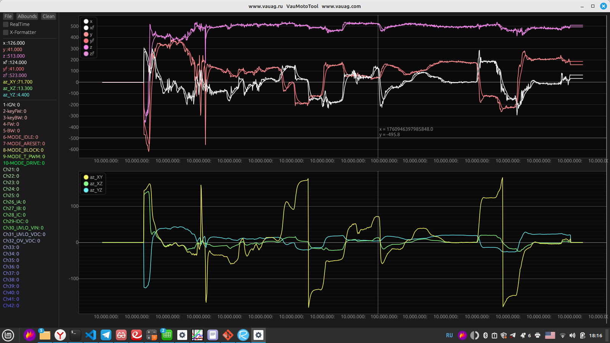
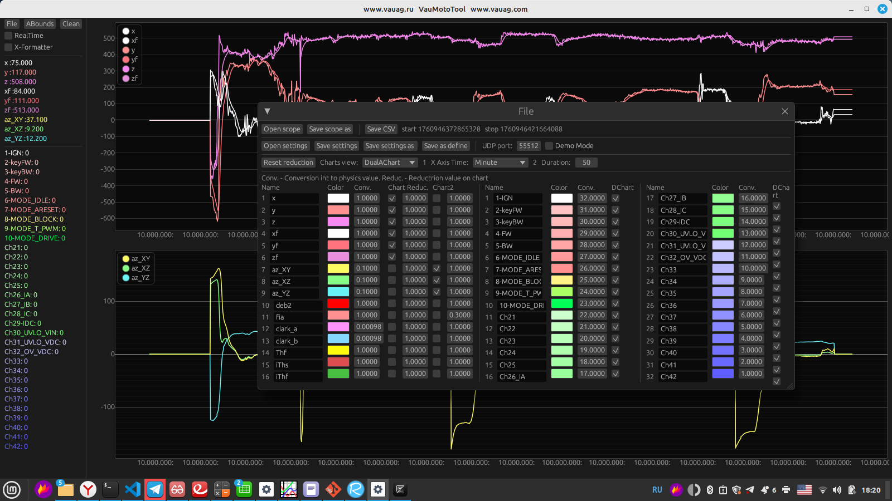

VauMotoTool - утилита мониторинга электропривода
Motor drivers monitoring utilite

ready-to-run binaries in BUILDS folder

www.vauag.ru
www.vauag.com
+7-909-520-4224
lead@vauag.ru

Rust + EGUI + EGUI_PLOT. The VauMoto tool utilite require Linux Mint/Ubuntu/Debian.

default UDP port 55512
External device as MCU or Oneboard PC send data in packet 0x5533..etc. format.  Timestamp increase in usecond the device.

Utilite have light interface. Support setting color, conversion coefficient to physical units and reduction for view any unit on one chart.  One time values show in left panel.

Check box "RealTime" start recive data stream.

Also can save scope/settings and export to CSV file.
Setting adds to scope file and after open scope upload its settings.

 Shotcut:  
Ctrl+A + wheel - Y axis chart 1 zoom  
Ctrl+Z + wheel - Y axis chart 2 zoom 
C - Set begin timestamp for CSV 
V - Set stop timestamp for CSV 
wheel - X axis zoom in view mode 

Sample format:
0x5533<timestamp><data1><data2>..<data8><data9><CS>
<timestamp> - 4 bytes in us. Increment with overflow.
<data1> - 2 bytes. Analog chanel 0- 12 bits.
<data2> - 2 bytes. Analog chanel 1- 12 bits.
..
..
<data16> - 2 bytes. Analog chanel 16 - 12 bits.
<data9> - 4 bytes. Digital chanels 32 bits.
<CS> - 2 bytes. Check sum
Sample length 44 bytes.

Расчет CS по всем байтам начиная с 0x5533:
    uint16_t checksum(uint8_t *ptr, uint16_t len)//, uint8_t type)
    {
        uint32_t sum = 0;

        /*if(type == 1) // это для UDP
        {
            sum+=IP_UDP;
            sum+=len-8;
        }  */

        while(len > 0)
        {
            sum += (uint16_t) (((uint32_t)*ptr<<8) |*(ptr+1));
            ptr+=2; //переходим еще на 16 бит
            len-=2; //
        }
        if (len) sum+=((uint32_t)*ptr)<<8;
        while(sum>>16) sum = (uint16_t)sum+(sum>>16);
        return ~((uint16_t)sum); //сдесь мы переобразовали к виду big endian и сделали побитовую инверсию
    }

Samples test generator in test_generator folder. Start up $python udp-sender.py
